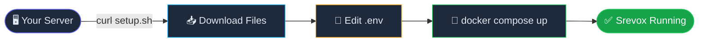
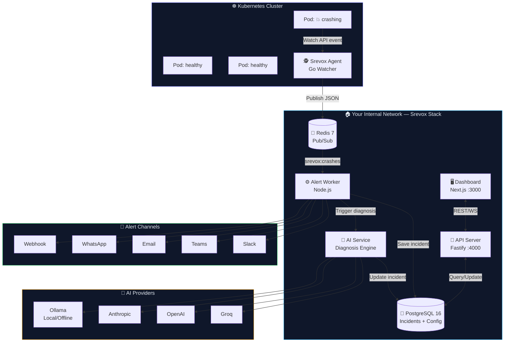
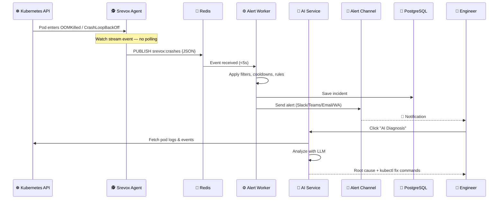
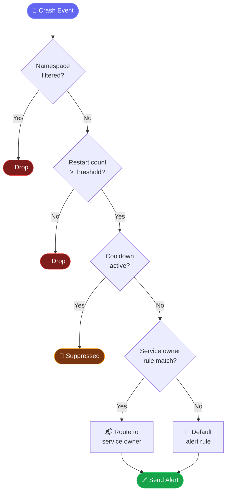
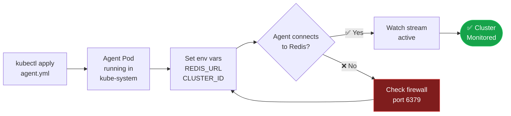
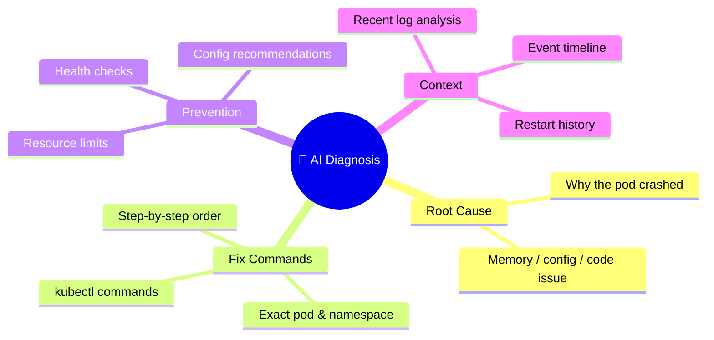
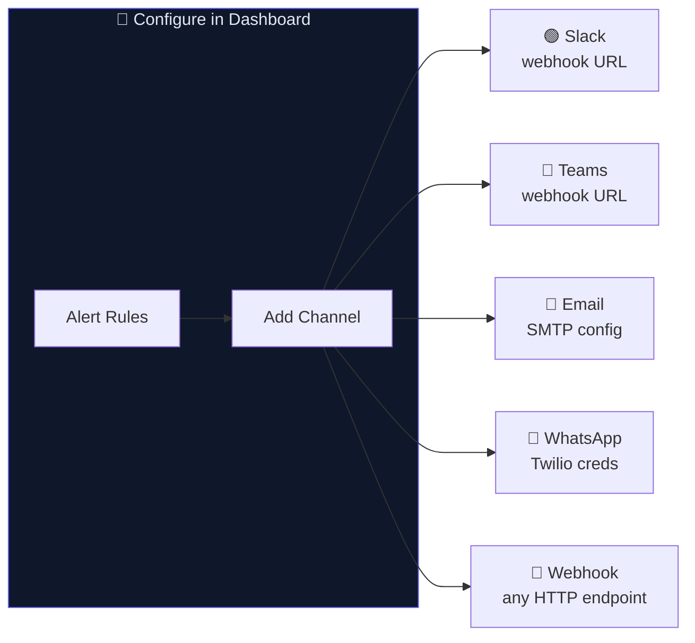
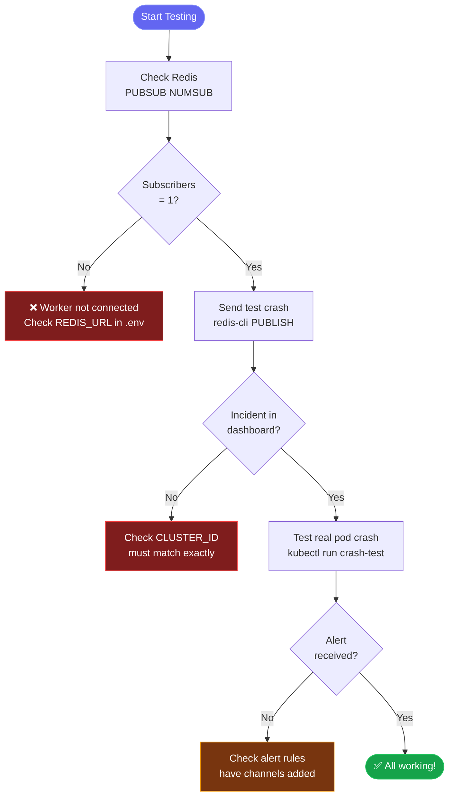

<div align="center">

<br/>


<br/>

# ⚡ Srevox

### **Catch crashes before your users do.**

*Real-time Kubernetes crash detection with AI-powered root cause analysis — fully self-hosted.*

<br/>

[](https://hub.docker.com/u/akshatsaini08)
[](#-license)
[](https://golang.org)
[](https://nodejs.org)

<br/>

> 🐳 **No clone needed. Just Docker + a `.env` file.**
> Built for on-prem, VMware, bare-metal, private cloud & air-gapped environments.

<br/>

[🚀 Quick Start](#-quick-start--no-clone-needed) · [🏗️ Architecture](#%EF%B8%8F-architecture) · [🔌 Connect Cluster](#-connect-your-k8s-cluster) · [🤖 AI Diagnosis](#-ai-diagnosis)

</div>

---

## 🌟 Why Srevox?

| Without Srevox | With Srevox |
|---|---|
| 😰 Users report crashes to you | ⚡ You know before users notice |
| 🔍 Manual `kubectl logs` digging | 🤖 AI gives root cause + fix steps |
| 📱 No team alerting | 🔔 Slack, Teams, Email, WhatsApp |
| ☁️ Vendor lock-in monitoring | 🔒 100% self-hosted, data stays yours |
| 🐢 Polling-based, delayed alerts | 🚀 Sub-5s detection via Watch API |

---

## ✨ Feature Highlights

<table>
<tr>
<td width="50%">

**🔍 Detection & Alerting**
- ⚡ Sub-5s crash detection via K8s Watch API
- 🔔 Email, Teams, Slack, WhatsApp, Webhook
- 🛡️ Noise control: cooldowns & restart thresholds
- 🏷️ Namespace & label-based filtering

</td>
<td width="50%">

**🤖 AI-Powered Intelligence**
- 🧠 Root cause analysis on every crash
- 🛠️ Step-by-step `kubectl` fix commands
- 🌐 Groq, OpenAI, Anthropic, or local Ollama
- 🔑 Per-user AI provider configuration

</td>
</tr>
<tr>
<td width="50%">

**🏗️ Infrastructure**
- ☁️ EKS, GKE, AKS, on-prem, k3s, RKE
- 🐳 Docker-native — one `docker-compose.yml`
- 🔒 Runs entirely inside your network
- 💾 PostgreSQL-backed incident history

</td>
<td width="50%">

**👥 Team & Access**
- 👤 Service owner routing
- 🔐 Role-based access (admin/member/viewer)
- 📊 Incident dashboard & acknowledgement
- 🔑 JWT-secured API

</td>
</tr>
</table>

> 👥 **Multi-Tenant Team Isolation**: Team management, user invitation flows, and login evaluation are fully stable. Multiple organizations can safely register the same email address without cross-tenant side-effects or leakage.

---

## 🚀 Quick Start — No Clone Needed

### Prerequisites

```
✅ Docker
✅ Docker Compose
❌ No Kubernetes experience needed for setup
❌ No code to clone or build
```

### Step-by-step Setup



**1️⃣ One-command setup**

```bash
curl -fsSL https://raw.githubusercontent.com/Akshatsainiaks/srevox-setup/main/setup.sh | bash
```

**2️⃣ Configure your environment**

```bash
cd srevox && nano .env
```

```env
# ── Required ─────────────────────────────────────────────────────
POSTGRES_PASSWORD=your_secure_password
BACKEND_SECRET_KEY=any_random_32_char_string_here__   # min 32 chars
ENCRYPTION_KEY=exactly_32_chars_here____________       # exactly 32 chars
NEXT_PUBLIC_API_URL=http://YOUR_SERVER_IP:4000
FRONTEND_URL=http://YOUR_SERVER_IP:3000

# ── AI Diagnosis (pick one) ───────────────────────────────────────
AI_PROVIDER=groq                                       # groq | openai | anthropic | ollama
GROQ_API_KEY=gsk_...                                   # free at console.groq.com
```

**3️⃣ Launch**

```bash
docker compose up -d
```

| Service | URL | Default Credentials |
|---|---|---|
| 🖥️ Dashboard | `http://YOUR_SERVER_IP:3000` | `admin@srevox.local` / `admin123` |
| 🔌 API | `http://YOUR_SERVER_IP:4000` | JWT-secured |

> ⚠️ **Change the default password immediately after first login.**

---

## 🏗️ Architecture

### System Overview



### Crash Detection Flow



### Alert Rule Evaluation



---

## 🔌 Connect Your K8s Cluster

### Deployment Flow



```bash
# 1. Deploy the agent
kubectl apply -f \
  https://raw.githubusercontent.com/Akshatsainiaks/srevox-setup/main/srevox-agent.yml

# 2. Configure it (get CLUSTER_ID from Dashboard → Clusters → Add Cluster)
kubectl set env deployment/srevox-agent -n kube-system \
  REDIS_URL=redis://YOUR_SREVOX_IP:6379 \
  CLUSTER_ID=YOUR_UUID_FROM_DASHBOARD \
  CLUSTER_NAME=production

# 3. Verify it's watching
kubectl logs -n kube-system deployment/srevox-agent -f
```

---

## 🤖 AI Diagnosis

Click **"AI Diagnosis"** on any incident to instantly receive:



### Supported AI Providers

| Provider | Speed | Cost | Internet Required | Best For |
|---|---|---|---|---|
| 🟢 **Groq** | ⚡ Fastest | Free tier | Yes | Self-hosted default |
| 🔵 **OpenAI** | Fast | Paid | Yes | GPT-4o quality |
| 🟣 **Anthropic** | Fast | Paid | Yes | Complex analysis |
| 🟡 **Ollama** | Medium | Free | ❌ Never | Air-gapped environments |

Configure per-user: **Dashboard → Settings → AI Diagnosis**

---

## 🔔 Alert Channels Setup



<details>
<summary><b>📧 Email / Gmail Setup</b></summary>

```
SMTP Host    → smtp.gmail.com
SMTP Port    → 587
SMTP User    → you@gmail.com
SMTP Pass    → App Password (Google Account → Security → App Passwords)
To           → oncall@yourcompany.com
```
</details>

<details>
<summary><b>💬 Microsoft Teams Setup</b></summary>

```
webhook_url → https://your-org.webhook.office.com/webhookb2/...
```
Get this from: Teams Channel → ⋯ More → Connectors → Incoming Webhook
</details>

<details>
<summary><b>🟢 Slack Setup</b></summary>

```
webhook_url → https://hooks.slack.com/services/T.../B.../...
```
Get this from: api.slack.com → Your Apps → Incoming Webhooks
</details>

<details>
<summary><b>📱 WhatsApp (via Twilio)</b></summary>

```
account_sid → ACxxxxxxxxxxxxxxxxxxxxxxxxxxxxxxxx
auth_token  → your_auth_token
from        → whatsapp:+14155238886
to          → whatsapp:+91XXXXXXXXXX
```
</details>

---

## ⚙️ Environment Variables

### Required

| Variable | Description | Example |
|---|---|---|
| `POSTGRES_PASSWORD` | Database password | `s3cur3p@ss!` |
| `BACKEND_SECRET_KEY` | JWT signing key (min 32 chars) | `my_super_secret_key_32chars!!` |
| `ENCRYPTION_KEY` | Channel config encryption (**exactly** 32 chars) | `exactlythirtytwocharactershere!` |
| `NEXT_PUBLIC_API_URL` | API URL seen from browser | `http://192.168.1.10:4000` |
| `FRONTEND_URL` | Dashboard URL for CORS | `http://192.168.1.10:3000` |

### Optional — AI Diagnosis

| Variable | Description |
|---|---|
| `AI_PROVIDER` | `groq` / `openai` / `anthropic` / `ollama` |
| `GROQ_API_KEY` | Free at [console.groq.com](https://console.groq.com) |
| `OPENAI_API_KEY` | OpenAI API key |
| `ANTHROPIC_API_KEY` | Anthropic API key |
| `OLLAMA_BASE_URL` | Local Ollama URL (e.g. `http://localhost:11434`) |

### Optional — Email Alerts

| Variable | Description |
|---|---|
| `SMTP_HOST` | SMTP server hostname |
| `SMTP_PORT` | Port (`587` for TLS) |
| `SMTP_USER` | SMTP username / email |
| `SMTP_PASS` | Password or App Password |

---

## 🐳 Docker Images

| Image | Tag |
|---|---|
| `akshatsaini08/srevox-api` | `latest` |
| `akshatsaini08/srevox-frontend` | `latest` |
| `akshatsaini08/srevox-worker` | `latest` |
| `akshatsaini08/srevox-ai` | `latest` |
| `akshatsaini08/srevox-agent` | `latest` |

All images are on [Docker Hub →](https://hub.docker.com/u/akshatsaini08)

---

## 🧪 Testing Your Setup

### Health Check Workflow



**Verify alert worker is connected**
```bash
redis-cli -h YOUR_REDIS_IP -p 6379 PUBSUB NUMSUB srevox:crashes
# Expected: (integer) 1
```

**Send a test crash event**
```bash
redis-cli -h YOUR_REDIS_IP -p 6379 PUBLISH srevox:crashes '{
  "cluster_id":     "YOUR_CLUSTER_UUID",
  "pod_name":       "test-pod",
  "namespace":      "default",
  "container_name": "app",
  "crash_reason":   "OOMKilled",
  "restart_count":  5,
  "exit_code":      137,
  "pod_labels":     {},
  "raw_event":      {},
  "detected_at":    "2026-05-16T14:00:00Z"
}'
```

**Simulate a real pod crash**
```bash
kubectl run crash-test --image=busybox --restart=Always -- /bin/sh -c "exit 1"
kubectl get pod crash-test -w
kubectl delete pod crash-test
```

### Troubleshooting

| Symptom | Likely Cause | Fix |
|---|---|---|
| `PUBSUB NUMSUB` → `0` | Worker not connected | Check `REDIS_URL` in `.env` |
| `PUBLISH` returns `0` | No subscribers | Restart alert worker container |
| "All channels filtered" | Rule has no channels | Dashboard → Alert Rules → Add Channel |
| Agent can't reach Redis | Firewall or bind issue | Open port `6379`; set `bind 0.0.0.0` in Redis config |
| No incidents in dashboard | `CLUSTER_ID` mismatch | Must match UUID exactly from Dashboard |
| `pods is forbidden` / Permission Error | Missing agent RBAC permissions | Apply RBAC permissions. See [RBAC Setup Guide](docs/agent-rbac.md) |

---

## 🔐 Security

- 🔑 Channel configs **encrypted at rest** in PostgreSQL
- 🛡️ JWT tokens signed with `BACKEND_SECRET_KEY`
- 🔒 Redis should be **LAN-only** — never expose port `6379` to the internet
- 🌐 Use **nginx or Caddy with TLS** in production environments
- 📦 No data leaves your network — all AI calls go directly from your server

---

## 📄 License

All rights reserved. Srevox is proprietary software. The configurations, deployment files, and setup scripts provided in this repository are for personal or internal company self-hosted use. Commercial redistribution or managed-service offerings require a commercial license.

---

<div align="center">

**Built for teams that run their own infrastructure.**

*No cloud. No SaaS. No data leaving your network.*

⚡ **Srevox** — Catch crashes before your users do.

[🐳 Docker Hub](https://hub.docker.com/u/akshatsaini08) · [🐛 Issues](https://github.com/Akshatsainiaks/srevox-setup/issues) · [⭐ Star](https://github.com/Akshatsainiaks/srevox-setup)

</div>
